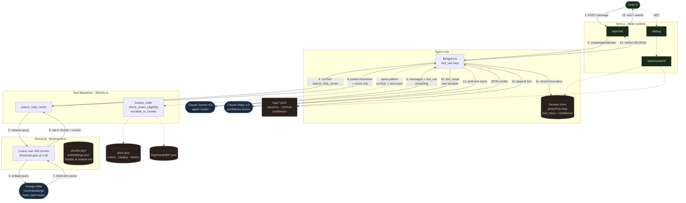
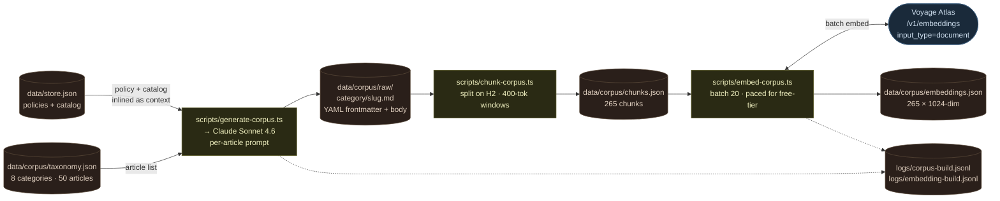

# Architecture

Two diagrams: the **runtime** agent loop (what happens when a customer
sends a chat message) and the **build-time** corpus pipeline (what
happens once, offline, to produce the retrieval index). They are
deliberately separated — build-time runs as a set of pnpm scripts
against the Anthropic and Voyage APIs; runtime serves a single chat
turn off in-memory state plus three live API calls (Sonnet for the
agent loop, Voyage for the query embedding, Haiku for post-turn
confidence scoring).

The runtime side is intentionally lean. CLAUDE.md pre-commits to no
database, no vector store, no auth, no voice for Weekend 1; Path 2
added a corpus but kept the same posture. The 265-chunk index fits
in ~1 MB of hot vectors, cosine over the full set takes ~2 ms, and
the interesting latency is the query-embedding round trip. The three
non-obvious choices worth flagging up front:

1. **Voyage via MongoDB Atlas (`ai.mongodb.com/v1/embeddings`), not
   the public Voyage endpoint.** Our API key is scoped to Atlas and
   returns 403 on the direct Voyage host; we also skip the `voyageai`
   npm SDK because its 0.2.1 release ships a broken ESM export. Native
   `fetch` against the Atlas URL is both smaller and more reliable.
2. **In-memory session state via `globalThis`.** The Path 1 design
   used a module-scope `Map`, which silently empties across route
   handlers in Next dev (each route compiles to its own module
   instance). Hoisting to `globalThis` gives `/api/chat` and
   `/api/session/[id]` a shared handle without introducing a real
   store.
3. **Dual-signal confidence is instrumentation, not a gate.** The
   Haiku self-scorer and the retrieval-derived score are logged and
   rendered in `/debug` but never used to branch the agent. We wanted
   to measure calibration first; surfacing when the two disagree has
   been the more valuable finding than either score alone.

---

## Runtime — agent loop (worked example: "how do I season a cast iron pan")

**What the worked example shows.** A customer asks about cast-iron
care (steps 1–2). The agent loop sends the transcript to Sonnet
(step 3), which returns a `tool_use` block requesting
`search_help_center` with a reformulated query. `runTool` dispatches
to the tool impl (step 4), which calls `retrieve()`. Retrieval
embeds the query via Voyage Atlas with `input_type="query"` — the
asymmetric pair to the `input_type="document"` used at build time —
computes cosine against the 265 precomputed vectors, checks the
top-1 against the 0.40 threshold, and returns the top-5 with scores
and timing (steps 5–8). The tool joins those chunks into a small
Markdown document with headers and gives it back to the loop (step
9), which feeds it as `tool_result` to Sonnet for the next
iteration (step 10). Sonnet produces the final streamed reply. In
the `finally` block the agent loop makes a side call to Haiku to
score the reply against the user message (step 12) and appends
everything — tool invocations, confidence object, turn log — to the
session store and JSONL logs (steps 11, 13). The `/debug` route
(dashed edges) reads that same state back through
`/api/session/[id]` so the interview surface renders exactly the
state the agent saw, not a sanitized view.

**The three other tools follow the same dispatcher pattern** —
`runTool` looks up the handler by name; `lookup_order` and
`check_return_eligibility` read `store.json`, `escalate_to_human`
writes a handoff payload and flips the session terminal. Retrieval
is the only tool that touches an external API at request time.

---

## Build-time — corpus pipeline (offline, runs once per corpus change)

**What the build pipeline does.** Three scripts, three artifacts,
each stage re-runnable against the previous stage's output.
`generate-corpus.ts` takes the canonical topic list in
`taxonomy.json` plus the policy block + catalog from `store.json`
(inlined as ground-truth context) and produces 50 Markdown articles
with YAML frontmatter. The consistency rule — every factual claim
overlapping `store.json` must derive from `store.json` — is enforced
at generation time by the system prompt. `chunk-corpus.ts` strips
frontmatter, splits on H2 boundaries, and emits 265 chunks with a
`char/4` token estimate; a re-chunking re-reads raw markdown without
re-calling Claude. `embed-corpus.ts` batches 20 chunks per call
against the Atlas endpoint with `input_type="document"` (asymmetric
to the runtime query side) and writes a single ~5 MB JSON of
`{chunk_id, vector}` pairs. The free-tier ceiling of 3 RPM / 10K TPM
is the binding constraint for the full corpus; the script paces
itself with a 21-second inter-batch delay by default.

The runtime diagram depends on `chunks.json` and `embeddings.json`.
Nothing else in the build pipeline is reached at request time. If
`store.json` changes, the full chain re-runs; the articles are the
only stage that's expensive (~20 s × 50 articles via Sonnet), and
re-chunking + re-embedding are both under a minute.
